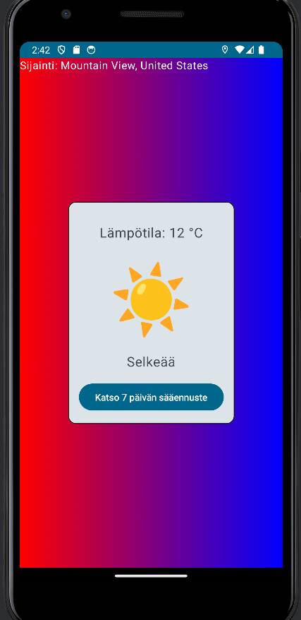
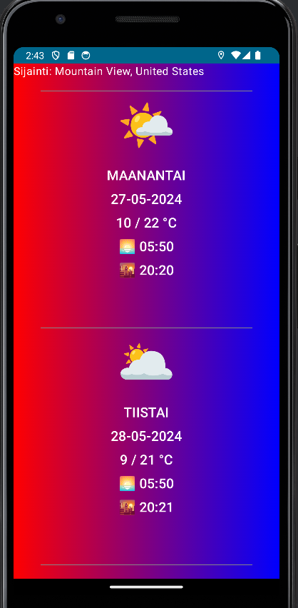
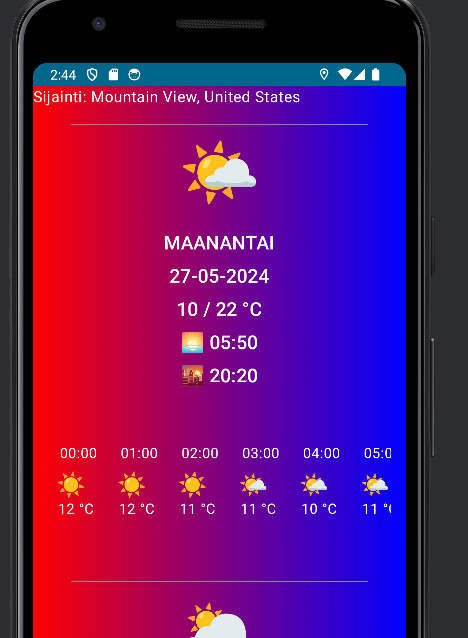

# Weather Forecast application for android phone using Kotlin

mobile project work is Android App made with Kotlin. There is possibility to
check current weather, 7-day forecast and 7-day forecast with 24
hourly temperature with weather icon base on users location which use google
gps and ask permission to use location information. This app fetch all from
open API [www.](https://open-meteo.com/v2)

# Motivation

Motivation behind the creation was that this was pretty interesting school
project work and motivation came by Kotlin development teacher to make
Weather forecast Android application

# Screenshots

# Tech/framework used

Languages used: Kotlin, Jetpack Compose

API dependencies:

- retrofit2:retrofit:2.9.0 - retrofit2:converter-gson:2.9.0

  for make API calls to api url and change json to readable text

Lifecycle dependencies:

- lifecycle:lifecycle-viewmodel-compose:2.7.0

  easy to use help functions, used with google location service.

GPS dependencies:

- com.google.android.gms:play-services-location:21.2.0

This dependencie is for GPS working with app and asking permissions.

UI framework Jetpack Compose:
Material3 and other Jetpack Compose UI libraries, Brush to make linear
color backround, Spacer to make Spacing lines to daily buttons

# Installation

For working this you have to have Android phone

There is 4 different releases:

1.0 : First Release
2.0 : Second Release
3.0 : Third Release
4.1 : Fourth Release

Release 4.1 is latest and final version.

You have to have pretty new android version:
Tested: (last informationsecurity update 2021) Did not worked.

Worked atleast march 2023 and newer updates.

You can go to Release tab on right in this page and download apkX.X.zip
(recomend apk4.1) download apk4.1.zip to your phone, excract file and download
app-debug.apk to your device

# API Reference

https://open-meteo.com/en/docs

You can create your own api interface json url

# Screencast

# Author

Juho Viskari
